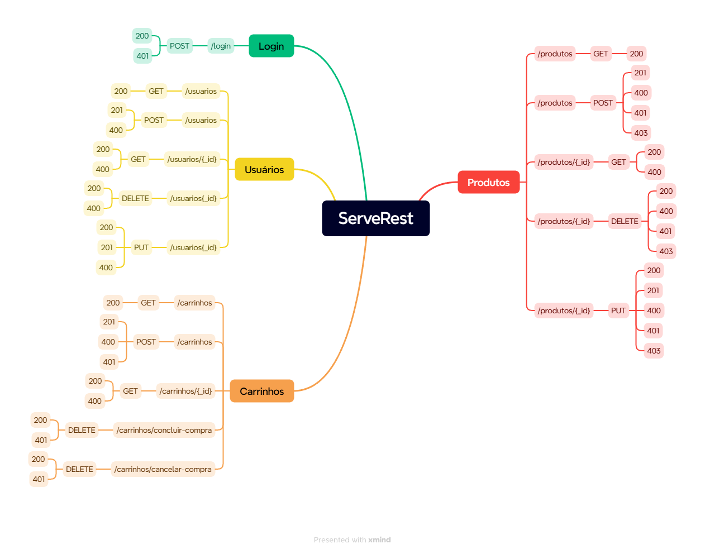

# Plano de Testes – Release 2.29.7 da API ServeRest

## 1. Apresentação
Este plano de testes descreve a abordagem e execução para validar a release **2.29.7** da API ServeRest, garantindo conformidade com os requisitos funcionais e reduzindo riscos de falhas em produção.

## 2. Objetivo
- Definir a estratégia de testes da release.  
- Garantir que os requisitos funcionais sejam atendidos.  
- Reforçar a confiabilidade do sistema por meio de cenários de borda.  
- Suportar testes automatizados de APIs REST utilizando **Robot Framework**.  

## 3. Escopo
**Incluído:**  
- Login  
- Módulo de usuários (Listagem usuários, Cadastro de usuário, Listagem de usuário por id, Exclusão de usuário e edição de usuário)  
- Módulo de produtos (Listagem de produtos, Cadastro de produto, Busca de produto por id, Exclusão de produto e Edição de produto)  
- Módulo de carrinho (Listagem de carrinhos cadastrados, Cadastro de carrinho, Busca de carrinho por id, Exclusão de carrinho e retorno de produtos ao estoque)  

**Excluído:**  
- Testes de performance, carga e estresse  
- Testes de segurança avançados  
- Integrações externas  

**Testes a serem realizados (User Story):**
- **US001** – Sendo um vendedor de uma loja, gostaria de poder me cadastrar no Marketplace do ServeRest, para poder realizar as vendas dos meus produtos.  
- **US002** – Sendo um vendedor de uma loja com cadastro já realizado, gostaria de poder me autenticar no Marketplace da ServeRest, para poder cadastrar, editar, atualizar e excluir meus produtos.  
- **US003** – Sendo um vendedor de uma loja com cadastro já realizado, gostaria de poder me autenticar e cadastrar produtos no Marketplace do ServeRest, para poder cadastrar, editar, atualizar e excluir meus produtos.  

## 4. Análise
Resumo da análise dos requisitos e riscos técnicos:  
- Requisitos funcionais críticos: **autenticação, cadastro de produto e carrinho**.  

## 5. Técnicas Aplicadas
- Testes Funcionais  
- Teste Positivo  
- Teste Negativo  
- Teste de Limite  
- Teste de Robustez  

## 6. Mapa Mental da Aplicação

## 7. Cenários de Teste Planejados

| ID    | Módulo   | Cenário                                | Entrada / Payload                                                                                          | Resultado Esperado                                                                 | Tipo de Teste          |
|-------|----------|----------------------------------------|-------------------------------------------------------------------------------------------------------------|------------------------------------------------------------------------------------|------------------------|
| CT-01 | Login    | Login com credenciais válidas           | `{ "email": "teste@hotmail.com", "password": "teste" }`                                                     | Retorno 200, token Bearer válido. Mensagem: "Login realizado com sucesso"          | Funcional / Positivo   |
| CT-02 | Login    | Login com senha incorreta               | `{ "email": "teste@hotmail.com", "password": "teste215" }`                                                  | Retorno 401, Mensagem: "Email e/ou senha inválidos"                                | Funcional / Negativo   |
| CT-03 | Login    | Login com campos vazios                 | `{ "email": "", "password": "" }`                                                                           | Retorno 400, Mensagens de campo obrigatório                                         | Funcional / Negativo   |
| CT-04 | Usuários | Criar usuário válido                    | `{ "nome": "Ana teste", "email": "teste@hotmail.com", "password": "teste", "administrador": "true" }`        | Retorno 201, Mensagem: "Cadastro realizado com sucesso"                            | Funcional / Positivo   |
| CT-05 | Usuários | Criar usuário com email inválido        | `{ "nome": "Ana teste", "email": "teste@hotmail", "password": "teste", "administrador": "true" }`            | Retorno 400, Mensagem: "email deve ser um email válido"                            | Funcional / Negativo   |
| CT-06 | Usuários | Criar usuário com payload grande        | `{ "nome": "A" * 300, "email": "teste@hotmail", "password": "teste", "administrador": "true" }`              | Retorno 400                                                                        | Limite / Robustez      |
| CT-07 | Produtos | Listar produtos existentes              | GET `/produtos`                                                                                             | Retorno 200, array de produtos                                                     | Funcional / Positivo   |
| CT-08 | Produtos | Buscar produto inexistente              | GET `/products/999`                                                                                         | Retorno 404, produto não encontrado                                                | Funcional / Negativo   |
| CT-09 | Produtos | Cadastrar Produto                       | `{ "nome": "maionese", "preco": 15, "descricao": "molhos", "quantidade": 500 }`                              | Retorno 201, cadastro realizado com sucesso                                        | Funcional / Positivo   |
| CT-10 | Carrinho | Adicionar produto válido ao carrinho    | `{ "productId":1, "quantity":2 }`                                                                           | Retorno 200, produto adicionado                                                    | Funcional / Positivo   |
| CT-11 | Carrinho | Adicionar produto com quantidade inválida | `{ "productId":1, "quantity":-1 }`                                                                          | Retorno 400, mensagem de erro                                                      | Funcional / Negativo   |
| CT-12 | Carrinho | Adicionar produto com payload grande    | `{ "productId":999999999999, "quantity":999999 }`                                                           | Retorno 400 ou tratamento de limite                                                | Limite / Robustez      |
| CT-13 | Carrinho | Remover produto do carrinho             | DELETE `/cart/1`                                                                                            | Retorno 200, produto removido                                                      | Funcional / Positivo   |
| CT-14 | Login    | Login com formato de e-mail inválido    | `{ "email": "ana#hotmail.com", "password": "teste" }`                                                       | Retorno 400, mensagem: "email deve ser um email válido"                            | Funcional / Negativo   |
| CT-15 | Produtos | Cadastrar produto com preço negativo    | `{ "nome": "teste", "preco": -10, "descricao": "inválido", "quantidade": 5 }`                               | Retorno 400, mensagem: "preço deve ser maior que zero"                             | Limite / Negativo      |
| CT-16 | Carrinho | Tentar adicionar produto inexistente    | `{ "productId":9999, "quantity":1 }`                                                                        | Retorno 404, mensagem: "Produto não encontrado"                                    | Funcional / Negativo   |
| CT-17 | Produtos | Excluir produto presente em carrinho    | DELETE `/produtos/1` (produto já em carrinho)                                                               | Retorno 400, mensagem de erro → estoque deve ser ajustado corretamente             | Integração / Negativo  |
| CT-18 | Usuários | Cadastrar usuário com e-mail hotmail/gmail | `{ "email": "ana@hotmail.com" }`                                                                            | Retorno 400, mensagem: "email deve ter um domínio diferente de hotmail ou gmail"   | Funcional / Negativo   |
| CT-19 | Usuários | Cadastrar usuário com senha < 5 chars   | `{ "nome": "Joao", "email": "teste@hotmail.com", "password": "1234", "administrador": "true" }`              | Retorno 400, mensagem: "senha deve conter mais de 5 caracteres"                    | Funcional / Negativo   |
| CT-20 | Usuários | Cadastrar usuário com senha > 10 chars  | `{ "nome": "Joao", "email": "teste@hotmail.com", "password": "12345678900", "administrador": "true" }`        | Retorno 400, mensagem: "senha deve conter entre 5 e 10 caracteres"                 | Funcional / Negativo   |

## 8. Priorização da Execução dos Cenários de Teste

- **Alta:** CT-01, CT-04, CT-09, CT-10, CT-14, CT-15, CT-18, CT-19, CT-20  
  *Fluxos críticos para uso do sistema*  

- **Média:** CT-07, CT-13, CT-17  
  *Funcionalidade importante, mas não bloqueadora*  

- **Baixa:** CT-05, CT-06, CT-11, CT-12, CT-16  
  *Cenários alternativos*  

## 9. Matriz de Risco

| Risco                     | Impacto | Probabilidade | Severidade |
|---------------------------|---------|---------------|------------|
| Falha no login            | Alto    | Baixa         | Alto       |
| Erro no cadastro de produto | Alto    | Baixa         | Alto       |
| Erro ao cadastrar carrinho | Alto    | Baixa         | Alto       |
| Erro ao cadastrar produto  | Alto    | Baixa         | Alto       |
| Erro ao cadastrar usuário  | Alto    | Baixa         | Alto       |
| Erro ao deletar produto    | Médio   | Baixa         | Baixa      |
| Erro ao deletar usuário    | Médio   | Baixa         | Baixa      |
| Erro ao deletar carrinho   | Alto    | Baixa         | Alto       |

## 10. Cobertura de Testes
- Cobertura de requisitos funcionais: **90%**  
- Automação planejada: **40% dos cenários críticos**  
- Cobertura manual: **60% para cenários complementares**  

## 11. Testes Candidatos à Automação
- **Login:** positivo/negativo (CT-01, CT-02, CT-03, CT-14)  
- **Usuários:** criação válida/inválida (CT-04, CT-05, CT-06, CT-18, CT-19, CT-20)  
- **Produtos:** cadastro e edição (CT-09, CT-15, CT-17)  
- **Carrinho:** adicionar/remover produtos (CT-10, CT-11, CT-12, CT-16, CT-13)  
