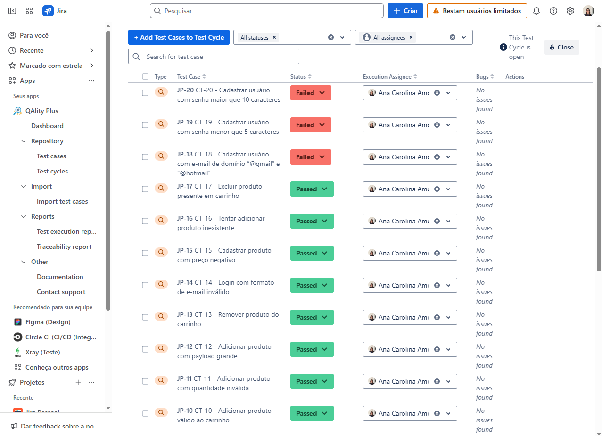
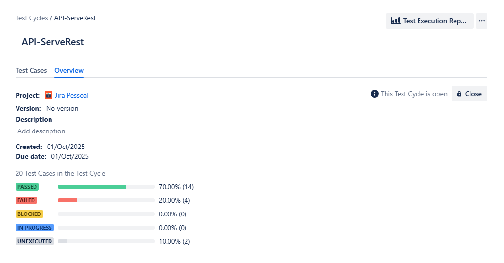

# Testes Automatizado com Robot Framework - API ServeRest

Este repositório contém os testes automatizados, o plano de testes e issues registradas da API ServeRest.

## Conteúdo do Repositório

- `tests/` - Contém os testes automatizados escritos em **Robot Framework**.
- `plano-de-testes/` - Contém o plano de testes detalhado, incluindo casos de teste, critérios de aceitação e prioridades.
- `issues/` - Documentação e acompanhamento das issues do projeto.

## Estrutura dos Testes

Os testes estão organizados em arquivos `.robot` dentro da pasta `tests/`. Cada arquivo representa um conjunto de casos de teste relacionados a uma funcionalidade específica.

### Exemplo de execução de um teste:

```bash
robot tests/nome_do_teste.robot 
```
## Dependências

Para executar os testes, é necessário ter instalado:

- [Python](https://www.python.org/)
- [Robot Framework](https://robotframework.org/)
- [RequestsLibrary](https://marketsquare.github.io/robotframework-requests/) (biblioteca usada para requisições HTTP nos testes)

```bash
pip install robotframework
```

```bash
pip install robotframework-requests
```

## Plano de Testes

O plano de testes define:

- Objetivos do teste
- Escopo e funcionalidades testadas
- Critérios de aceitação
- Priorização dos casos de teste

Ele está localizado na pasta `plano-de-testes/` e pode ser consultado por toda a equipe.

## Issues

A pasta `issues/` possui o report do bugs que foram encontrados com testes na Api

## Jira QAlity Plus 
Gerenciamento dos Tests Cases mapeado no plugin QAlity Plus do Jira

### Tela de mapeamento


### Overview



Projeto desenvolvido como Challenge para o estágio em QA da Compass UOL.